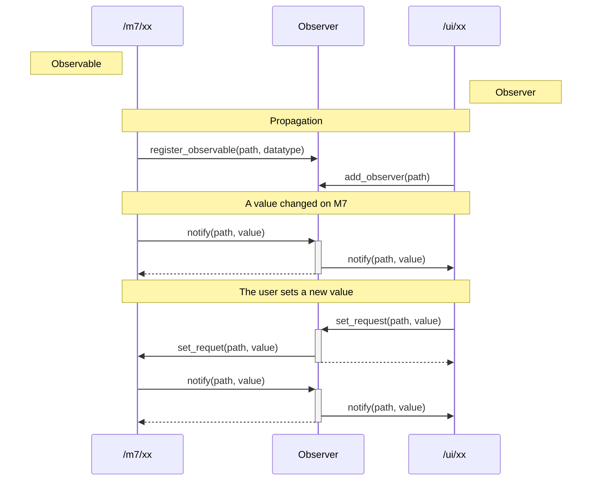

# experiment_datadefinitions

Using pydantic to specify the datamodel

## Core objectives

Development efforts should be focused on the company's core competencies. Software modules that serve only as infrastructure should, wherever possible, be generic or automatically generated.

This is enabled by a technology stack that minimizes the number of different programming languages and concepts used.

## Technology stack

Developer priority

* Relevant: 🎯 Must learn and understand the core concept
* Nice to know: 💡
* Under the hood: ⚙️ You hardly will get in touch with this


Stack

* Languages
  * 🎯 C on M7
  * 🎯 Python on Linux
* Linux
  * Distribution ⚙️ [yocto](https://www.yoctoproject.org/), ⚙️ [Torizon](https://www.torizon.io/)
* Python stack
  * 🎯 [asyncio](https://docs.python.org/3/library/asyncio.html)
  * datamodel: 🎯 [pydantic](https://pydantic.dev/) at the full glory
  * tests: 💡 [pytest](https://pytest.org/)
 * Templating Engine: 💡 [Jinja2](https://jinja.palletsprojects.com/en/stable/)
* AMP stack
  * OpenAMP: 💡 [remoteproc](https://openamp.readthedocs.io/en/latest/protocol_details/lifecyclemgmt.html) und 💡 [rpmsg](https://openamp.readthedocs.io/en/latest/protocol_details/rpmsg.html)
  * C to Python communication: Python ⚙️ [ctypes](https://docs.python.org/3/library/ctypes.html#ctypes-fundamental-data-types-2)
* Web stack
  * Web: 💡 [FastAPI](https://fastapi.tiangolo.com/)
    * Asynchronous Server Gateway Interface: ⚙️ [starlette](https://starlette.dev/)
    * Web Server: ⚙️ [uvicorn](https://uvicorn.dev/)
  * Web UI: 🎯 [NiceGUI](https://nicegui.io/)
    * UI Styling: ⚙️ [Tailwind CSS](https://tailwindcss.com/)
    * UI Elements ⚙️ [VueJs/Quasar](https://quasar.dev/)
    * Icons: ⚙️ [Google Material Icons](https://fonts.google.com/icons)
* Infrastrucure
  * IDE: 🎯 [Visual Studio Code](https://code.visualstudio.com/)
  * Virtualization: 💡 [Docker](https://www.docker.com/), ⚙️ [Devcontainer](https://containers.dev/), 💡 [Github Codespaces](https://github.com/features/codespaces). This is used for building and regression testing

## Observer Design



Other observables might be:

| Use case | read/write access | Communication Channel |
| - | - | - | 
| Log file | read only | python logging |
| Grafana log interface | read only | [influxdb-client](https://github.com/influxdata/influxdb-client-python) or mqtt |
| Customer dashboard | read only | [REST API](https://en.wikipedia.org/wiki/REST) or Websockets |
| Customer control interface | read and write | [REST API](https://en.wikipedia.org/wiki/REST) or Websockets |

## Setting values

### via named pipe

```bash
echo "/axis_x/value int(56)" > namedpipe
```

### via REST api

http://127.0.0.1:8000/docs#/default/customer_api_set_request_customer_api_set_request_get

topic: /axis_x/value
value: int(56)

or

```bash
curl -X 'GET' 'http://127.0.0.1:8000/customer_api/set_request?topic=/axis_x/value&topic_value=int(128)'
```

## customer observer

May be used to feed a customer dashboard or grafana.

```python
python -m utils.util_websocket_listener
Connecting to ws://127.0.0.1:8000/customer_api/observer ...
Connected. Waiting for notifications...
{
  "ok": true,
  "subscribed": true
}
{
  "path": "/axis_x/value",
  "topic_value": 4094.0
}
```

or (requires websockets to be installed)

```bash
python -c 'import asyncio,websockets; exec("""async def main():
    async with websockets.connect("ws://127.0.0.1:8000/customer_api/observer") as ws:
        async for m in ws:
            print(m)
"""); asyncio.run(main())'
```

or (requires uv to be installed)

```bash
uv run --with websockets python -c 'import asyncio,websockets;exec("async def main():\n async with websockets.connect(\"ws://127.0.0.1:8000/customer_api/observer\") as ws:\n  async for m in ws:\n   print(m)");asyncio.run(main())'
{"ok":true,"subscribed":true}
{"path":"/axis_x/value","topic_value":4094.0}
{"path":"/axis_x/value","topic_value":4093.0}
```
